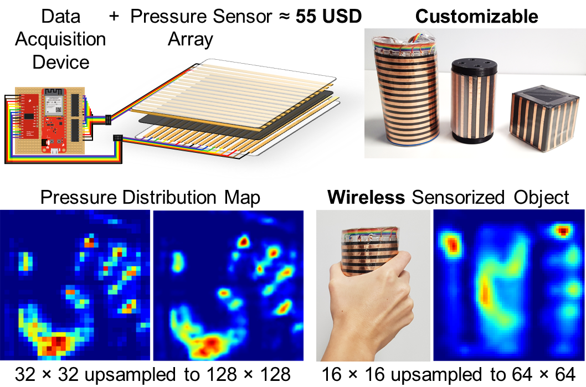
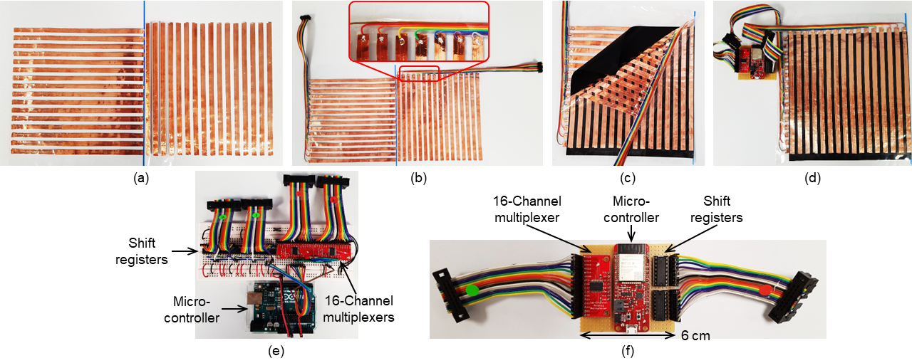

# Wireless Pressure Sensor Array Module for Sensorized Object



This repo contains some details for the paper: Wireless Pressure Sensor Array Module for Sensorized Object.

[**Preprint**](https://arinex.com.au/EMBC/pdf/full-paper_359.pdf) | [**Paper**](https://doi.org/10.1109/EMBC40787.2023.10340284) | [**Project**](https://gmntu.github.io/psa/)


## Fabrication steps of a 16 by 16 pressure sensor array module

- (a) Lay the copper strips on an insulating material. 
- (b) Solder the ribbon cables onto the copper strips.
- (c) Place the Velostat in between the two layers of copper strips.
- (d) Connect the pressure sensor array to the DAQ device.
- (e) Example of DAQ device assembled on a breadboard with Arduino Uno for a 32 by 32 sensor array.
- (f) A compact version of DAQ device (6 $\times$ 6 $\times$ 2 cm) with ESP32 Thing Plus for a 16 by 16 sensor array.
- Note: The main reference of this setup is based on [O-mat](https://www.instructables.com/id/O-mat/), which consists of detailed steps to lay the copper strips, solder the strips to connect with a multiplexer, circuit connections, and Arduino codes.


List of items: 
- https://www.sparkfun.com/products/10561 (Copper strips) 
- https://www.sparkfun.com/products/14110 (Velostat) 
- https://www.sparkfun.com/products/14492 (Resistors 1K Ohms) 
- https://www.sparkfun.com/products/9056 (16-Channel Analog/Digital Multiplexer) 
- https://www.sparkfun.com/products/15663 (Microcontroller: ESP32 Thing Plus)


If you find our work useful, please consider citing
```BibTeX
@inproceedings{psa:2023,
  title     = {Wireless Pressure Sensor Array Module for Sensorized Object},
  author    = {Guan Ming, Lim and Prayook, Jatesiktat and Christopher Wee Keong, Kuah and Wei Tech, Ang},
  booktitle = {45th Annual International Conference of the IEEE Engineering in Medicine and Biology Society (EMBC)},
  year      = {2023}
}
```
