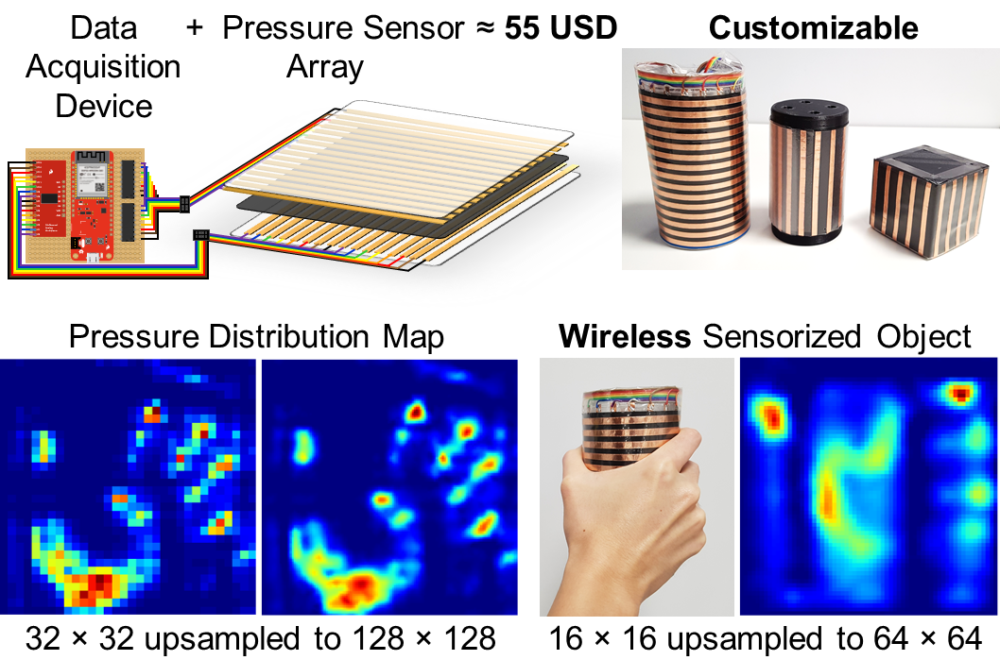

## Overview

This work presents a pressure sensor array module that is:
* **Low-cost** (around 55 USD)
* **Customizable** (easy-to-build and vary the size of sensing area)
* **Wireless** (suitable for portable and wireless application)

## Videos

Summary video:

<iframe width="640" height="360" src="https://www.youtube.com/embed/aW_NSEHc3rI" frameborder="0" allow="accelerometer; autoplay; encrypted-media; gyroscope; picture-in-picture" allowfullscreen></iframe>

Click on the lists below for more details:

<b>Pressure distribution map</b>

Realtime generation of pressure distribution map with different objects
 
 
<li>Left image: Original resolution (<b>32 by 32</b>)</li>
<li>Right image: Upsampled four times (<b>128 by 128</b>)</li>
<iframe width="640" height="360" src="https://www.youtube.com/embed/vcOgkFjeVOU" frameborder="0" allow="accelerometer; autoplay; encrypted-media; gyroscope; picture-in-picture" allowfullscreen></iframe>
 
 
<li>Left image: Original resolution (<b>16 by 16</b>)</li>
<li>Right image: Upsampled four times (<b>64 by 64</b>)</li>
<iframe width="640" height="360" src="https://www.youtube.com/embed/MtDBYo3cDaU" frameborder="0" allow="accelerometer; autoplay; encrypted-media; gyroscope; picture-in-picture" allowfullscreen></iframe>

<b>Object pose estimation</b>

8 objects with 4 different shapes (arc, triangle, rectangle and semicircle) and 2 different sizes (large and small)
 
   
<li>Testing on sensor array with <b>32 by 32</b> sensing elements</li>
<iframe width="640" height="360" src="https://www.youtube.com/embed/0KO4MP07DSc" frameborder="0" allow="accelerometer; autoplay; encrypted-media; gyroscope; picture-in-picture" allowfullscreen></iframe>
 
   
<li>Testing on sensor array with <b>16 by 16</b> sensing elements</li>
<iframe width="640" height="360" src="https://www.youtube.com/embed/7sSoLkiWePw" frameborder="0" allow="accelerometer; autoplay; encrypted-media; gyroscope; picture-in-picture" allowfullscreen></iframe>

<b>Grasp classification</b>

 
<li>Grasp classification on sensorized cylindrical / cuboid object</li>
<iframe width="640" height="360" src="https://www.youtube.com/embed/-hUVe4ekWHM" frameborder="0" allow="accelerometer; autoplay; encrypted-media; gyroscope; picture-in-picture" allowfullscreen></iframe>
 
   
<li>Hand grasping pressure distribution (sensorized cylindrical object)</li>
<iframe width="640" height="360" src="https://www.youtube.com/embed/vlyW6yW9tQo" frameborder="0" allow="accelerometer; autoplay; encrypted-media; gyroscope; picture-in-picture" allowfullscreen></iframe>

## Software Codes

To be uploaded ...
